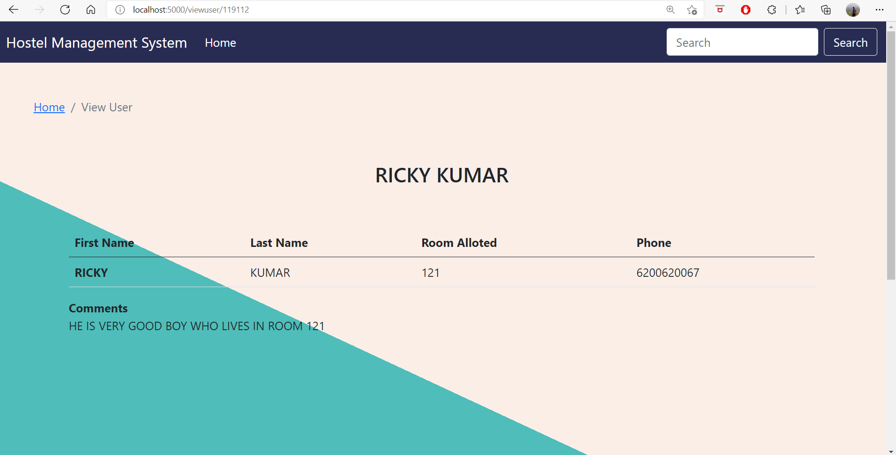

# HostelManagementWebsite
A beautiful and minimal interface which can be used to maintain details of students residing in hostel.
Before using this project make sure to install all the essential libraries.  
A few of them has been listed below->  
-> express  
-> express-handlebars  
-> mysql  
-> body-parser  
-> path    
and others too if you need them..

#### To install use:  
npm -i <package_name>  

#### for example, if you want to install express  
npm -i express

#### Signin-page-> This is the page you see when you log-in, a database is attached to the sign-in to contain all  
#### the details of the administrators.  
  

#### Front page where we select the data we want to view  
  

#### The details home page where all the names of the hosteliers are stored along with the basic information  
  

#### Detailed information of a single residing member  
  

#### Details of every room, details regarding people staying in a single room:  
  

#### We can add more details to every table whenever we want, we can consider this project as a skeleton  
#### for many other projects.
